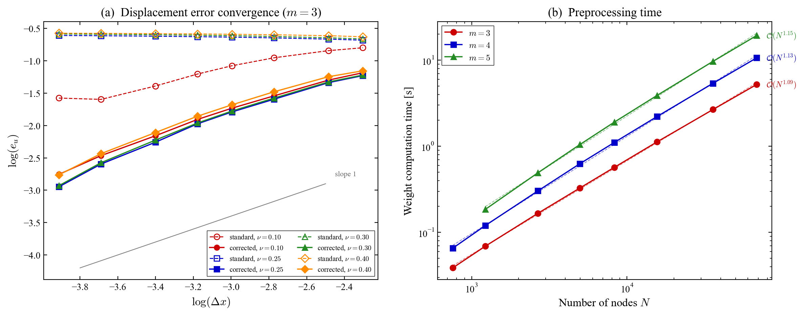
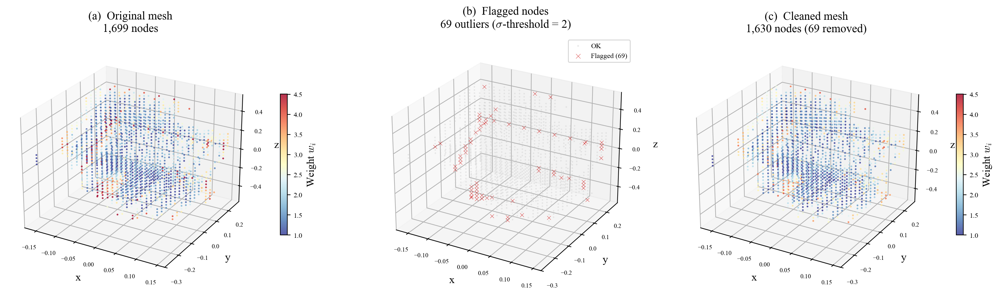

# perifit

**Surface correction weights for 3-D peridynamics (state-based LPS, bond-based, and correspondence NOSB-PD) with mesh quality diagnostics**

[](https://github.com/Hereon-InstituteMS/perifit/actions)
[](https://pypi.org/project/perifit/)
[](https://pypi.org/project/perifit/)
[](LICENSE)

`perifit` computes optimised nodal influence weights that eliminate
the **surface/boundary effect** in three-dimensional peridynamics.

Supported models:
| Model | CLI flag | Operator rows | Notes |
|-------|----------|---------------|-------|
| **OSB-PD** (ordinary state-based, LPS) | `--model osb` | 109 | Poisson-unrestricted |
| **BB-PD** (bond-based) | `--model bb` | 54 | ν = 1/4 in 3D |
| **NOSB-PD** (non-ordinary, correspondence) | `--model nosb` | 36 | Material-independent |

Provide any 3-D mesh → get per-node weights in formats ready for
**Peridigm**, **PeriLab**, or generic CSV / DAT / VTK.

---

## Background

In peridynamics, nodes near the domain boundary have truncated horizon
neighbourhoods. This reduces their effective stiffness and causes
displacement errors that do **not** vanish under mesh refinement at fixed
horizon-to-spacing ratio *m = δ/Δx* — the so-called *surface effect*.

`perifit` implements an operator-matching framework for state-based (LPS), bond-based
(solid), and correspondence (NOSB-PD) models. For each node, a local overdetermined least-squares
problem is solved to find a scalar influence weight *wᵢ* such that the
truncated neighbourhood operators reproduce their full-sphere continuum
counterparts. The per-node weights are coupled through a global sparse
linear system solved by BiCGSTAB.

> **The weights are purely geometric.**
> Material constants (*G* for state-based, *c* for bond-based) appear as
> common prefactors in both the local ML matrix and the analytical targets
> and cancel exactly after per-row normalisation. For the correspondence
> model, the operator rows are material-independent by construction (no
> radial singularity, no constitutive constants). Consequently, *E*, *ν*,
> and any other material constant are **not required** — only the mesh
> geometry and the horizon matter.

---

## Results

### Convergence and preprocessing time (state-based LPS)



**(a)** Displacement error convergence for the **state-based LPS** model on a unit bar under uniaxial tension (*m* = 3).
The corrected weights (solid lines) recover first-order convergence across all
Poisson ratios, while standard LPS (dashed) stagnates due to the surface effect.
**(b)** Weight computation time scales near-linearly with the number of nodes.

### Mesh quality diagnostics (state-based LPS)



**(a)** Rocker-arm geometry (1,699 nodes) colored by **LPS** weight values.
**(b)** Outlier nodes flagged by the built-in diagnostics (2*σ* threshold).
**(c)** Cleaned mesh after removing the 69 flagged nodes — weight distribution
is now uniform and well-conditioned.

---

## Installation

```bash
pip install perifit
```

With optional dependencies for specific mesh formats:

```bash
pip install "perifit[hdf5]"     # PeriLab HDF5 output
pip install "perifit[exodus]"   # Exodus mesh input
pip install "perifit[gmsh]"     # Gmsh / Abaqus / VTU input
pip install "perifit[all]"      # everything
```

---

## Quick start

### Built-in demo (no mesh needed)

```bash
perifit --demo
```

Runs on the bundled 1000-node structured cube mesh and writes
`csv`, `dat`, and `vtk` output to `./perifit_output/`.

### Python API

```python
import numpy as np
from perifit import compute_weights, write_weights

# Build your mesh (or load it — see below)
dx = 0.05
xs = np.arange(dx / 2, 1.0, dx)
gx, gy, gz = np.meshgrid(xs, xs, xs, indexing='ij')
coords = np.column_stack([gx.ravel(), gy.ravel(), gz.ravel()])

# OSB-PD / LPS (default model is "bb"):
volumes = np.full(len(coords), dx**3)
weights = compute_weights(coords, volumes, horizon=3 * dx, model='osb')

# BB-PD:
weights = compute_weights(coords, volumes, horizon=3 * dx, model='bb')

# NOSB-PD (material-independent):
weights = compute_weights(coords, volumes, horizon=3 * dx, model='nosb')

# Export to any format
write_weights(
    coords, volumes, weights,
    outdir='./output',
    formats=['csv', 'vtk', 'peridigm', 'perilab'],
)
```

### Load from a mesh file

```python
from perifit import load_mesh, compute_weights, write_weights

# Supported: .csv .dat .txt .npy .npz .vtk .vtu .exo .g .msh .inp
coords, volumes = load_mesh('my_mesh.exo')

weights = compute_weights(coords, volumes, horizon=3 * dx, model='osb')

write_weights(coords, volumes, weights,
              outdir='./weights',
              formats=['peridigm', 'perilab', 'csv'])
```

### Mesh quality diagnostics

```python
from perifit import compute_weights
from perifit.quality import diagnose_weights, clean_mesh

weights = compute_weights(coords, volumes, horizon=delta)

# Diagnose: flag negative weights and statistical outliers
diag = diagnose_weights(weights, threshold_sigma=2.0)
print(diag.summary)

# Clean: remove flagged nodes
result = clean_mesh(coords, volumes, weights, threshold_sigma=2.0)
print(f"Removed {result.original_n - result.cleaned_n} nodes")
```

### Command-line interface

```bash
# OSB-PD / LPS
perifit --mesh nodes.csv --model osb

# BB-PD (default)
perifit --mesh nodes.csv --model bb

# NOSB-PD (material-independent weights)
perifit --mesh nodes.csv --model nosb

# Specify horizon-to-spacing ratio (default is 3)
perifit --mesh nodes.csv --m-ratio 4 --output csv,vtk

# Provide the horizon explicitly instead
perifit --mesh solid.exo --horizon 0.005 --output peridigm

# Diagnose mesh quality after computing weights
perifit --mesh cube.csv --diagnose

# Clean mesh (remove negative/outlier weight nodes)
perifit --mesh cube.csv --clean --threshold-sigma 2.0

# Show all options
perifit --help
```

---

## Supported input formats

| Extension | Format | Notes |
|-----------|--------|-------|
| `.csv`, `.txt`, `.dat` | Plain text | Columns: x, y, z[, volume] |
| `.npy` | NumPy array | Shape (N, 3) or (N, 4) |
| `.npz` | NumPy archive | Keys: `coords`[, `volumes`] |
| `.vtk` | Legacy VTK ASCII | Unstructured or structured |
| `.vtu` | VTK XML | Requires `pyvista` or `meshio` |
| `.exo`, `.g` | Exodus II | Requires `netCDF4` or `meshio` |
| `.msh` | Gmsh v2/v4 | Requires `meshio` |
| `.inp` | Abaqus | Requires `meshio` |

## Supported output formats

| Format | Description |
|--------|-------------|
| `csv`  | `node_id, x, y, z, volume, weight` |
| `dat`  | Space-delimited text |
| `vtk`  | Legacy ASCII VTK for ParaView / VisIt |
| `peridigm` | Text mesh + weight CSV + YAML input snippet |
| `perilab`  | HDF5 mesh with `Nodal_Surface_Correction` field + YAML snippet |

---

## Applying the weights in your solver

The bond-averaged influence weight is

```
w̄ᵢⱼ = (wᵢ + wⱼ) / 2
```

Replace every occurrence of the unit influence function `ω(ξ) = 1`
in your PD discretisation with `w̄ᵢⱼ`. The Peridigm and PeriLab
output files include a YAML template showing exactly where to hook in
the field.

---

## Auto-inference of dx, volumes, and horizon

The nodal spacing `dx` is always estimated automatically as the
**median nearest-neighbour distance** (KD-tree, O(N log N)).
This is used to:

1. Set nodal volumes to `dx³` when not provided.
2. Compute the horizon as `delta = m_ratio × dx` when `--horizon` is not given.
3. Check consistency when **both** `--horizon` and `--m-ratio` are supplied.

### Input modes

| `--horizon` | `--m-ratio` | Behaviour |
|-------------|-------------|-----------|
| not given   | not given   | horizon = 3 × dx (default m=3) |
| not given   | given       | horizon = m_ratio × dx |
| given       | not given   | horizon used directly |
| given       | given       | horizon used; **warning** if inconsistent with m_ratio × dx |

---

## License

MIT — see [LICENSE](LICENSE).
